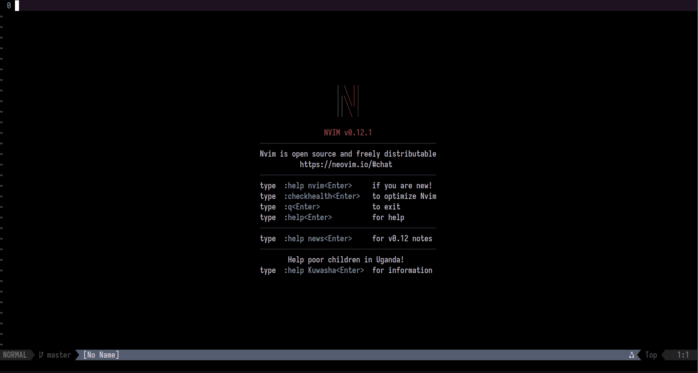

# Neovim Configuration

Personal Neovim setup using Lazy.nvim for plugin management.

## Plugins

- **LSP**: nvim-lspconfig + mason.nvim (language servers)
- **Autocomplete**: nvim-cmp with LSP snippets
- **Telescope**: Fuzzy finder
- **Treesitter**: Syntax highlighting
- **UI**: Minimal interface with statusline

## LSP Servers

| Language | Server |
|----------|--------|
| Lua | lua_ls |
| C/C++ | clangd |
| Rust | rust_analyzer |
| Python | pyright |
| Markdown | marksman |

## Keybindings

- `gd` - goto definition
- `gr` - references
- `K` - hover
- `gl` - diagnostic float
- `<F2>` - rename
- `<F3>` - format
- `<F4>` - code actions

## Requirements

- Neovim ≥ 0.10
- Git
- ripgrep (rg)
- fd